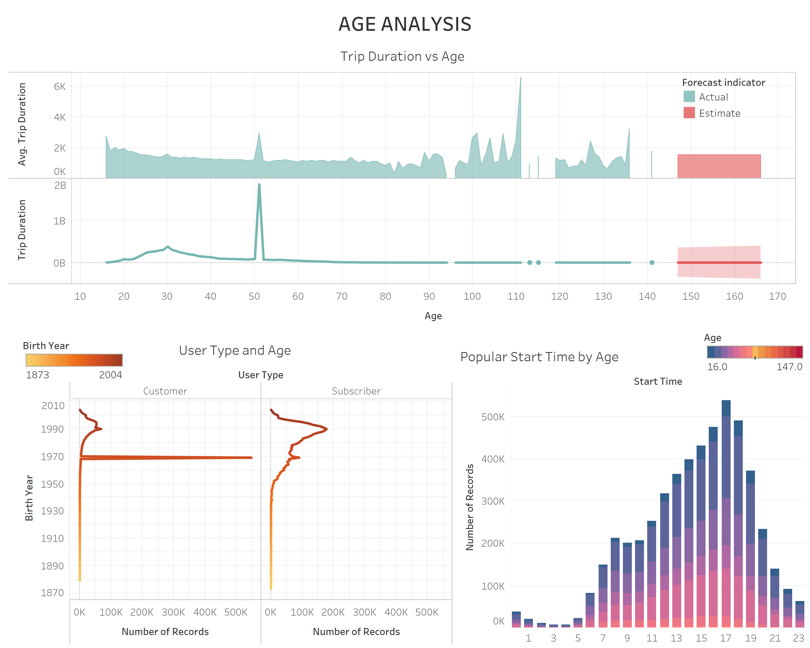

# NYC Bike Analytics During Covid-19 Lockdwon

#### Tableau Public Website

https://public.tableau.com/profile/kay.royo#!/vizhome/citibike_analytics/NYCBIKEANALYSIS

https://us-west-2b.online.tableau.com/#/site/kayr/workbooks/250727?:origin=card_share_link

## Background
Since 2013, the Citi Bike Program has implemented a robust infrastructure for collecting data on the program's utilization. Through the team's efforts, each month bike data is collected, organized, and made public on the [Citi Bike Data](https://www.citibikenyc.com/system-data) webpage. The downloaded dataset includes the recorded data for March, April, May, and June 2020.

## Data Analysis and Findings
* I: Station Analysis

>   The maps show the locations of the start and end stations. The size of the markers is determined by the number of records for each station. 
>   * 1. The comparison between two maps reveals that the end stations are slightly more scattered than the start stations.
>   * 2. There are more records for start stations during the first two months (March and April) of the Covid-19 lockdown than May and June.
>   * 3. During the last two months of the lockdown (May and June), the start stations' number of records are lower and higher for some of the end stations than previous months. 
>   * 4. The most popular start and end stations are located in the central part of the city. 
>   * 5. There is no significant correlation between population and the number of records for each station during the Covid-19 lockdown. 

>   * 1. The top 10 most popular stations remain the same for both start and end. 
>   * 2. The most popular station (12 Ave & W 40 St)  has over 30,000 number of records

* II: Bike Analysis

>   * 1. The most popular bike has more than 1,000 number of records from March-June 2020. 
>   * 2. Bike ID 30627 has the highest trip duration based on the March-June 2020 data. 
>   * 3. Bike ID 36552 has the highest number of records (March-June 2020). 

* III: Age Analysis

>   * 1. The highest trip duration during the 4-month Covid-19 lockdown is at age 51. 
>   * 2. The peak at age 111 for average trip duration can be determined as erroneous. 
>   * 3. There are more costumers than subscribers at age 50. 
>   * 4. There are more subscribers than costumers at age 30. 
>   * 5. There number of subscribers and costumers is roughly the same for ages older than 50. 

* IV: Gender Analysis

>   * 1. Male has the highest trip duration for all 4 months during the lockdown.  
>   * 2. The trip duration of females and unknown slightly increased from March to June and slightly decreased for males. 
>   * 3. The lowest trip duration for all gender is during the month of April while the highest is during the month of June. 

>   * 1. The most popular start and stop time for all gender is 5:00 pm (17:00)
>   * 2. The highest average trip duration for females was in the month of April at age 100-110. 

* V: Trip Duration Analysis

>   * 1. May and June generally have higher trip duration than March and April. 
>   * 2. The highest trip duration recorded during the lockdown was on the 13th of June. 
>   * 3. The average trip duration appears to increase from the beginning until the end of March. 
>   * 4. There average trip duration for the month of June generally decreased. 
>   * 5. There average trip duration for all 4 months appear very unsteady. 
>   * 6. There highest average trip duration occur at the beginning of May and June. 

* VI: Distance Analysis

>   * 1. Bike ID 37088 has the highest total  distance traveled. 
>   * 2. The total distance traveled is highest at age 50 followed by age 30. 
>   * 3. Subscribers have higher distance traveled than costumers for both male and female. 

